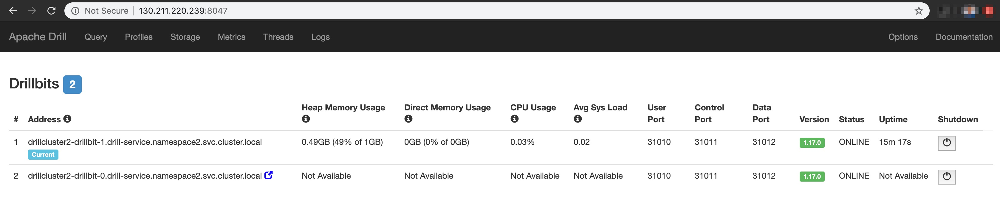

# Helm Charts for Apache Drill

## Overview
This repository contains a collection of files that can be used to deploy [Apache Drill](http://drill.apache.org/) on Kubernetes using Helm Charts. Supports single-node and [cluster](http://drill.apache.org/docs/installing-drill-in-distributed-mode/) modes.

#### What are Helm and Charts?
[Helm](https://helm.sh/) is a package manager for [Kubernetes](https://kubernetes.io/). [Charts](https://helm.sh/docs/topics/charts/) are a packaging format in Helm that can simplify deploying Kubernetes applications such as Drill Clusters.

## Pre-requisites

- A Kubernetes Cluster (this project is tested on [GKE](https://cloud.google.com/kubernetes-engine/) clusters)
- [Helm](https://github.com/helm/helm#install) version 3 or greater
- [Kubectl](https://kubernetes.io/docs/tasks/tools/install-kubectl/) version 1.16.0 or greater

## Chart Structure
Drill Helm charts are organized as a collection of files inside of the `drill` directory. As Drill depends on Zookeeper for cluster co-ordination, a zookeeper chart is inside the [dependencies](drill/charts) directory. The Zookeeper chart follows a similar structure as the Drill chart.
```
drill/   
  Chart.yaml    # A YAML file with information about the chart
  values.yaml   # The default configuration values for this chart
  charts/       # A directory containing the ZK charts
  templates/    # A directory of templates, when combined with values, will generate valid Kubernetes manifest files
  ```
### Templates
Helm Charts contain `templates` which are used to generate Kubernetes manifest files. These are YAML-formatted resource descriptions that Kubernetes can understand. These templates contain 'variables', values for which  are picked up from the `values.yaml` file.

Drill Helm Charts contain the following templates:
```
drill/
  ...
  templates/
    drill-rbac-*.yaml       # To enable RBAC for the Drill app
    drill-service.yaml      # To create a Drill Service
    drill-web-service.yaml  # To expose Drill's Web UI externally using a LoadBalancer. Works on cloud deployments only. 
    drill-statefulset.yaml  # To create a Drill cluster
  charts/
    zookeeper/
      ...
      templates/
        zk-rbac.yaml        # To enable RBAC for the ZK app
        zk-service.yaml     # To create a ZK Service
        zk-statefulset.yaml # To create a ZK cluster. Currently only a single-node ZK (1 replica) is supported
```
### Values
Helm Charts use `values.yaml` for providing default values to 'variables' used in the chart templates. These values may be overridden either by editing the `values.yaml` file or during `helm install`. For example, such as the namespace, number of drillbits and more to the `template` files

Please refer to the [values.yaml](drill/values.yaml) file for details on default values for Drill Helm Charts.

## Usage
### Install

#### Simple Deploy
Drill Helm Charts can be deployed as simply as follows: 
```
# helm install <UNIQUE_NAME> drill/
helm install drill1 drill/
```
#### Override Drill Config
Overridding the following two Drill configuration files is currently supported:
- `drill/conf/drill-env.sh`
- `drill/conf/drill-override.conf`

Please edit/replace them as needed. Please do NOT rename/delete.

Once the above configuration files are ready, please create the `drill-config-cm` configMap to upload them to Kubernetes. When a Drill chart is deployed, the files contained within this configMap will be downloaded to each container and used by the drill-bit process during start-up.
```
./scripts/createCM.sh
```
or
```
kubectl create configmap drill-config-cm --from-file=./drill/conf/drill-override.conf --from-file=./drill/conf/drill-env.sh
```
Enable config overriding by editing the drillConf section in `drill/values.yaml` file.
#### Using Namespaces to Deploy Multple Drill Clusters
Kubernetes [Namespaces](https://kubernetes.io/docs/concepts/overview/working-with-objects/namespaces/) can be used when more that one Drill Cluster needs to be created. We use the `default` namespace by default. To create a namespace, use the following command:
```
# kubectl create namespace <NAMESPACE_NAME>
kubectl create namespace namespace2
```
This NAMESPACE_NAME needs to be provided in `drill/values.yaml`. Or can be provided in the `helm install` command as follows:
```
# helm install <HELM_INSTALL_RELEASE_NAME> drill/ --set global.namespace=<NAMESPACE_NAME>
helm install drill2 drill/ --set global.namespace=namespace2 --set drill.id=drillcluster2
```
Note that installing the Drill Helm Chart also installs the dependent Zookeeper chart. So with current design, for each instance of a Drill cluster includes a single-node Zookeeper.
#### List Pods
```
$ kubectl get pods
NAME                       READY   STATUS    RESTARTS   AGE
drillcluster1-drillbit-0   1/1     Running   0          51s
drillcluster1-drillbit-1   1/1     Running   0          51s
zk-0                       1/1     Running   0          51s

$ kubectl get pods -n namespace2
NAME                       READY   STATUS    RESTARTS   AGE
drillcluster2-drillbit-0   1/1     Running   0          47s
drillcluster2-drillbit-1   1/1     Running   0          47s
zk-0                       1/1     Running   0          47s
```
#### List Services
```
$ kubectl get services
NAME                    TYPE           CLUSTER-IP      EXTERNAL-IP       PORT(S)                                  AGE
drill-service           ClusterIP      10.15.242.217   <none>            8047/TCP,31010/TCP,31011/TCP,31012/TCP   3m49s
drillcluster1-web-svc   LoadBalancer   10.15.250.97    34.71.235.149     8047:30019/TCP,31010:32513/TCP           3m49s
zk-service              ClusterIP      10.15.243.254   <none>            2181/TCP,2888/TCP,3888/TCP               3m49s

$ kubectl get services -n namespace2
NAME                    TYPE           CLUSTER-IP      EXTERNAL-IP       PORT(S)                                  AGE
drill-service           ClusterIP      10.15.246.116   <none>            8047/TCP,31010/TCP,31011/TCP,31012/TCP   2m9s
drillcluster2-web-svc   LoadBalancer   10.15.249.214   130.211.220.239   8047:30019/TCP,31010:32513/TCP           2m9s
zk-service              ClusterIP      10.15.246.218   <none>            2181/TCP,2888/TCP,3888/TCP               2m9s
```
#### Access Drill Web UI
For cloud based deployments, we create a LoadBalancer type service with an EXTERNAL_IP address. Use this along with the HTTP port to access the Drill Web UI on a browser. Note that the URL is similar to a proxy which internally redirects to the Drill Web UI of any Drill pod. 
```
# http://EXTERNAL_IP:PORT
http://130.211.220.239:8047
```


### Upgrading Drill Charts
Currently only scaling up/down the number of Drill pods is supported as part of Helm Chart upgrades. To resize a Drill Cluster, edit the `drill/values.yaml` file and apply the changes as below:
```
# helm upgrade <HELM_INSTALL_RELEASE_NAME> drill/
helm upgrade drill1 drill/
```
Alternatively, provide the count as a part of the `upgrade` command:
```
# helm upgrade <HELM_INSTALL_RELEASE_NAME> drill/ --set drill.count=2
helm upgrade drill1 drill/ --set drill.count=2
```
If autoscaling is enabled, 
```
# helm upgrade <HELM_INSTALL_RELEASE_NAME> drill/ --set drill.count=<NEW_MIN_COUNT> --set drill.autoscale.maxCount=<NEW_MAX_COUNT>
helm upgrade drill1 drill/ --set drill.count=3 --set drill.autoscale.maxCount=6
```
### Autoscaling Drill Clusters
The size of the Drill cluster (number of Drill Pod replicas / number of drill-bits) can not only be manually scaled up or down as shown above, but can also be autoscaled to simplify cluster management. When enabled, with a higher CPU utilization, more drill-bits are added automatically and as the cluster load goes down, so do the number of drill-bits in the Drill Cluster. The drill-bits deemed excessive [gracefully shut down](https://drill.apache.org/docs/stopping-drill/#gracefully-shutting-down-the-drill-process), by going into quiescent mode to permit running queries to complete.

Enable autoscaling by editing the autoscale section in `drill/values.yaml` file.

### Package
Drill Helm Charts can be packaged for distribution as follows:
```
$ helm package drill/
Successfully packaged chart and saved it to: /Users/agirish/Projects/drill-helm-charts/drill-1.0.0.tgz
```

### Uninstall
Drill Helm Charts can be uninstalled as follows: 
```
# helm [uninstall|delete] <HELM_INSTALL_RELEASE_NAME>
helm delete drill1
helm delete drill2
```
Note that `LoadBalancer` and a few other Kubernetes resources may take a while to terminate. Before re-installing Drill Helm Charts, please make sure to wait until all objects from any previous installation (in the same namespace) have terminated.
